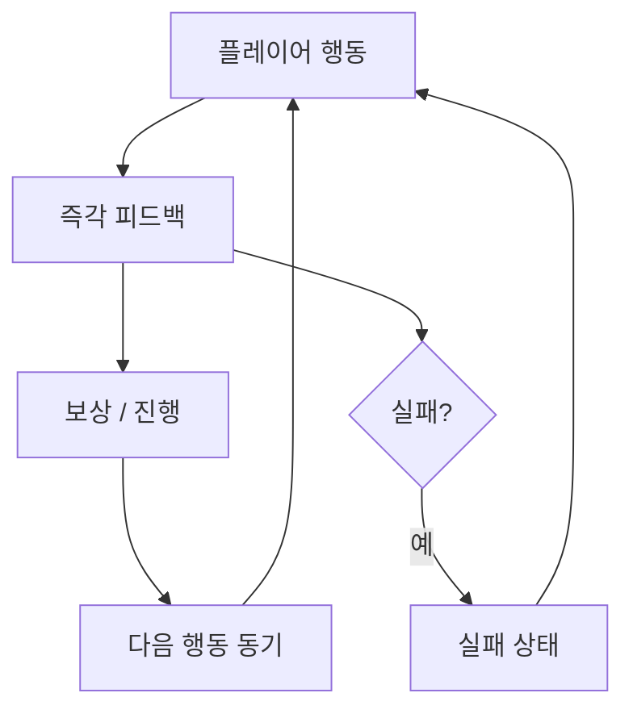

# Plan Visualization 스킬

## 스킬 정의

| 속성 | 값 |
|------|-----|
| 스킬명 | plan-visualization |
| 역할 | 기획 결과물(GDD, 스펙, 플로우)의 Mermaid/HTML 시각화 절차 정의 |
| 사용 에이전트 | plan-visualizer |
| 참조 규칙 | `C:\DevelopRule\Rule\Always\Always.md` |

---

## 시각화 대상

| 대상 | 적용 다이어그램 |
|------|--------------|
| 코어 루프 | `flowchart TD` |
| 게임 상태 머신 | `stateDiagram-v2` |
| 메카닉 의존 관계 | `flowchart LR` |
| 레벨 진행 구조 | `flowchart TD` |
| 캐릭터 스탯 관계 | `classDiagram` |
| 기획 일정·마일스톤 | `gantt` |
| 장르 포지셔닝 | `quadrantChart` |
| 기능 브레인스토밍 | `mindmap` |

---

## 시각화 절차

### 1단계 — 입력 분석

- plan-hub, plan-designer, plan-spec-writer로부터 시각화 대상 문서 수신
- 다이어그램 목적 파악 (발표용 / 내부 검토용 / 개발팀 전달용)
- 노드 수 예측 → 20개 초과 시 섹션 분할 계획

### 2단계 — 다이어그램 설계

- 각 섹션에 적합한 Mermaid 다이어그램 타입 매핑
- 레이블은 한국어 (사용자 요청 시 예외)
- 색상은 의미 구분용 (성공: green, 실패: red, 진행: blue, 중립: gray)
- 이모지 사용 금지

### 3단계 — HTML 생성

필수 HTML 구성:
```html
<!DOCTYPE html>
<html>
<head>
  <meta charset="UTF-8">
  <title>[기획 문서명]</title>
  <!-- 인라인 CSS: 라이트/다크 테마, max-width 1200px -->
  <script src="https://cdn.jsdelivr.net/npm/mermaid@10/dist/mermaid.min.js"></script>
</head>
<body>
  <!-- 헤더: 제목 + 날짜 + 원본 경로 + 테마 토글 버튼 -->
  <!-- 목차: 섹션별 앵커 링크 -->
  <!-- 섹션별: h2 제목 + 설명 + .mermaid 블록 -->
  <!-- 푸터: 생성일 + 원본 문서 링크 -->
</body>
</html>
```

### 4단계 — 저장 및 보고

- HTML 파일을 지정 경로에 Write
- 파일 경로와 브라우저 열람 방법 안내

---

## 출력 저장 위치

- 기획 시각화: `docs/visualization/{YYYY-MM-DD}-{주제}.html`
- 프로젝트 지정 시: 프로젝트 `docs/visualization/` 하위

---

## 코어 루프 시각화 템플릿



---

생성: 2026-05-01
