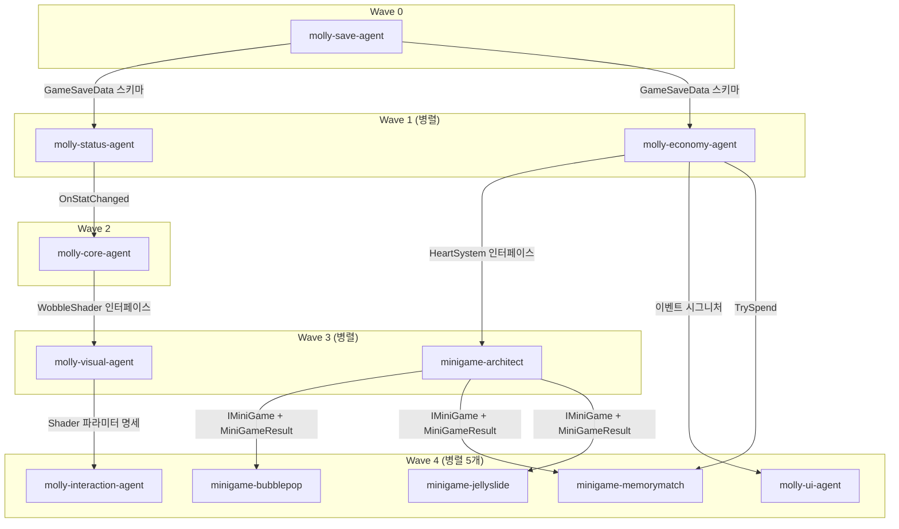

# Molly Team — 전용 에이전트 목록
> JellyMooly 프로젝트 전담 에이전트 / 최종 업데이트: 2026-05-01
> 에이전트 정의 위치: C:\DevelopRule\agents\molly-team\

---

## 팀 개요

SAD v1.0 기반 몰리 키우기 게임 개발 전담 팀.
CTO가 개발 팀장(dev-lead)을 통해 각 에이전트에게 작업을 배분한다.

**에이전트 총 수**: 11개

---

## Wave별 구성 (개발 단계 순서)

### Wave 0 — 인프라 (선행 필수)

| 에이전트 | 파일 | 책임 |
|---|---|---|
| molly-save-agent | molly-save-agent.md | SaveSystem, OfflineCareCalc, NotificationManager, GameSaveData 스키마 제공 |

**Wave 0이 반드시 먼저 완료되어야 하는 이유**: GameSaveData 스키마를 전체 에이전트에 제공하는 역할. 다른 에이전트들이 저장 필드 구조를 알아야 구현 가능.

---

### Wave 1 — 도메인 코어 (병렬 가능)

| 에이전트 | 파일 | 책임 | 의존성 |
|---|---|---|---|
| molly-status-agent | molly-status-agent.md | StatusSystem, CareSystem, 4가지 스탯 관리, OnStatChanged/OnStatWarning 이벤트 | Wave 0 |
| molly-economy-agent | molly-economy-agent.md | EconomySystem, HeartSystem, RewardSystem, MonetizationSystem | Wave 0 |

**병렬 처리 가능**: molly-status-agent와 molly-economy-agent는 상호 의존 없이 동시 구현 가능.

---

### Wave 2 — 캐릭터 코어 (Wave 1 완료 후)

| 에이전트 | 파일 | 책임 | 의존성 |
|---|---|---|---|
| molly-core-agent | molly-core-agent.md | MollyCore, EvoTracker 6개 카운터, EmotionState, EvolutionStage (7단계), WobbleShader 연동 | Wave 1 (OnStatChanged 시그니처) |

**MollyCore 진화 단계**: Baby → Kids → Teen → Cheerful(4-A)/Calm(4-B)/Chubby(4-C) → Legend(5)

---

### Wave 3 — 비주얼 + 미니게임 아키텍처 (병렬 가능)

| 에이전트 | 파일 | 책임 | 의존성 |
|---|---|---|---|
| molly-visual-agent | molly-visual-agent.md | WobbleShader(HLSL/ShaderGraph), Sprite Atlas, 파티클 프리팹, Spine 2D 연동 | Wave 2 (WobbleShader 인터페이스) |
| minigame-architect | minigame-architect.md | MiniGameManager, IMiniGame 인터페이스, MiniGameResult 구조체, 씬 전환 패턴, HeartSystem 연동 | Wave 1 (HeartSystem) |

**병렬 처리 가능**: molly-visual-agent와 minigame-architect는 독립적으로 병렬 진행 가능.

---

### Wave 4 — 인터랙션 + UI + 미니게임 구현 (병렬 가능)

| 에이전트 | 파일 | 책임 | 의존성 |
|---|---|---|---|
| molly-interaction-agent | molly-interaction-agent.md | InteractionSystem, 4종 제스처(Tap/Drag/Hold/Shake), WobbleShader 파라미터 제어, 파티클 Pool | Wave 3 (WobbleShader 파라미터 명세) |
| molly-ui-agent | molly-ui-agent.md | MainHomeUI, MiniGameUI, ShopUI, PopupManager, DOTween 트랜지션, HUD | Wave 1 이벤트 시그니처, Wave 3 (미니게임 결과 패널) |
| minigame-bubblepop | minigame-bubblepop.md | BubbleSpawner, BubbleController(7종), ComboSystem(1→2→3→5배), BubbleScoreSystem(S≥1500), BubbleTimerUI | Wave 3 (IMiniGame 인터페이스) |
| minigame-memorymatch | minigame-memorymatch.md | CardDeckGenerator, CardController, MatchChecker, MemoryStageManager(5단계), HintSystem(크리스탈 1개) | Wave 3 (IMiniGame 인터페이스), Wave 1 (TrySpend) |
| minigame-jellyslide | minigame-jellyslide.md | SlidingBoardManager(6x6 그리드), BFS 힌트, Undo 시스템, 레벨 데이터 JSON 로드 | Wave 3 (IMiniGame 인터페이스) |

**병렬 처리 가능**: 5개 에이전트 모두 동시 진행 가능 (각 의존성 충족 후).

---

## 에이전트별 상세 명세

### 1. molly-save-agent
- **모델**: opus
- **파일**: `C:\DevelopRule\agents\molly-team\molly-save-agent.md`
- **책임**:
  - SaveSystem JSON 직렬화/역직렬화 (Newtonsoft.Json 13.x)
  - GameSaveData 전체 스키마 정의 및 전파
  - OfflineCareCalc (경과시간 최대 8시간 배치 적용)
  - save.json.bak 백업/복원 로직
  - Google Play Games / Game Center 클라우드 동기화
  - NotificationManager 4종 로컬 알림 예약
- **출력**:
  - `Assets/_Project/Scripts/Systems/SaveSystem.cs`
  - `Assets/_Project/Scripts/Systems/OfflineCareCalc.cs`
  - `Assets/_Project/Scripts/Systems/NotificationManager.cs`
  - `Assets/_Project/Scripts/Data/GameSaveData.cs`
- **의존성**: 없음 (Wave 0, 최선행)

---

### 2. molly-status-agent
- **모델**: opus
- **파일**: `C:\DevelopRule\agents\molly-team\molly-status-agent.md`
- **책임**:
  - StatusSystem: Hunger(-6/h), Happiness(-4/h), Cleanliness(-3/h), Fatigue(+5/h)
  - 오프라인 배치 계산 (OfflineCareCalc 연동)
  - CareSystem: FeedAction / BathAction / SleepAction
  - OnStatChanged, OnStatWarning 이벤트 발행
- **출력**:
  - `Assets/_Project/Scripts/Systems/StatusSystem.cs`
  - `Assets/_Project/Scripts/Systems/CareSystem.cs`
- **의존성**: molly-save-agent (lastExitTime 읽기)
- **후속 알림**: molly-core-agent에 이벤트 시그니처 목록 전달 필수

---

### 3. molly-economy-agent
- **모델**: opus
- **파일**: `C:\DevelopRule\agents\molly-team\molly-economy-agent.md`
- **책임**:
  - EconomySystem: 젤리코인/크리스탈/하트 3종 재화 관리
  - HeartSystem: 30분마다 +1 자동 충전 (최대 5개)
  - RewardSystem: 미니게임 등급별 보상 환산 및 지급
  - MonetizationSystem: Unity Ads + Unity IAP 통합
- **출력**:
  - `Assets/_Project/Scripts/Systems/EconomySystem.cs`
  - `Assets/_Project/Scripts/Systems/HeartSystem.cs`
  - `Assets/_Project/Scripts/Systems/RewardSystem.cs`
  - `Assets/_Project/Scripts/Systems/MonetizationSystem.cs`
- **의존성**: molly-save-agent (isAdFree, 재화 잔액 저장)
- **후속 알림**: 이벤트 시그니처를 molly-core-agent, molly-ui-agent에 전달

---

### 4. molly-core-agent
- **모델**: opus
- **파일**: `C:\DevelopRule\agents\molly-team\molly-core-agent.md`
- **책임**:
  - MollyCore 클래스 (MonoBehaviour, MainHome 씬 귀속)
  - EvolutionStage 7단계 전환 로직
  - EmotionState 감정 재계산 (ApplyStatChange 기반)
  - EvoTracker 6개 카운터 누적 및 진화 판정
  - WobbleShader 파라미터 연동
- **출력**:
  - `Assets/_Project/Scripts/Core/MollyCore.cs`
  - `Assets/_Project/Scripts/Core/EvoTracker.cs`
- **의존성**: molly-status-agent (OnStatChanged 시그니처)

---

### 5. molly-visual-agent
- **모델**: opus
- **파일**: `C:\DevelopRule\agents\molly-team\molly-visual-agent.md`
- **책임**:
  - WobbleShader (URP HLSL 또는 Shader Graph, Vertex 전용)
  - Sprite Atlas 통합 (Android ETC2 / iOS ASTC 4x4)
  - 파티클 시스템 프리팹 (하트 30개, 파리 10개, 별 20개 Pool)
  - Spine 2D 연동 (감정별 애니메이션 트랙)
  - EmotionState별 표정 스프라이트 교체
- **출력**:
  - `Assets/_Project/Art/Effects/` (파티클 프리팹)
  - `Assets/_Project/Art/Molly/` (Sprite Atlas 설정)
  - Shader 파일
- **의존성**: molly-core-agent (TriggerEmotion 인터페이스)
- **후속 알림**: WobbleShader 파라미터 명세를 molly-interaction-agent에 선 제공

---

### 6. molly-interaction-agent
- **모델**: opus
- **파일**: `C:\DevelopRule\agents\molly-team\molly-interaction-agent.md`
- **책임**:
  - InteractionSystem: 4종 제스처 감지 (Tap/Drag-Pet/Hold/Shake)
  - Physics2D.OverlapPoint() 터치 교차 검사
  - WobbleShader 파라미터 직접 갱신 (Vertex만)
  - ParticleSystem Pool 제어 (하트/파리/별)
  - MollyCore.TriggerEmotion() 호출
- **출력**:
  - `Assets/_Project/Scripts/Systems/InteractionSystem.cs`
- **의존성**: molly-visual-agent (WobbleShader 파라미터 명세)

---

### 7. molly-ui-agent
- **모델**: opus
- **파일**: `C:\DevelopRule\agents\molly-team\molly-ui-agent.md`
- **책임**:
  - MainHomeUI: HUD(재화), StatBar(4스탯), 돌봄 버튼, 미니게임 진입 버튼
  - MiniGameUI: 공통 HUD + 게임별 특수 UI + 결과 패널(S/A/B/C)
  - ShopUI: Additive Overlay (코스튬, 재화, 하트 충전, 광고)
  - PopupManager: LIFO Stack (최대 3개), 스케일 바운스 연출
  - DOTween 트랜지션: 씬 전환 페이드, 보상 플라이 아웃
- **출력**:
  - `Assets/_Project/Scripts/UI/` 전체
- **의존성**: molly-economy-agent (재화 이벤트), molly-status-agent (스탯 이벤트)

---

### 8. minigame-architect
- **모델**: opus
- **파일**: `C:\DevelopRule\agents\molly-team\minigame-architect.md`
- **책임**:
  - MiniGameManager (GameManager 하위, DontDestroyOnLoad Singleton)
  - IMiniGame 인터페이스 정의
  - MiniGameResult/MiniGameType 구조체·열거형
  - 씬 전환 패턴 (LoadSceneAsync Single)
  - 해금 레벨 검사: Bubble=0, Memory=3, Sliding=5
  - HeartSystem.ConsumeHeart() 연동
- **출력**:
  - `Assets/_Project/Scripts/Core/MiniGameManager.cs`
  - `Assets/_Project/Scripts/MiniGames/IMiniGame.cs`
  - `Assets/_Project/Scripts/MiniGames/MiniGameResult.cs`
  - `Assets/_Project/Scripts/MiniGames/MiniGameType.cs`
- **의존성**: molly-economy-agent (HeartSystem 인터페이스)
- **후속 알림**: IMiniGame + MiniGameResult를 3개 미니게임 에이전트에 전달

---

### 9. minigame-bubblepop
- **모델**: opus
- **파일**: `C:\DevelopRule\agents\molly-team\minigame-bubblepop.md`
- **책임**:
  - BubbleSpawner (spawnInterval 1.2s → 0.5s, maxOnScreen 20)
  - BubbleController (7종 타입, Pool 30개)
  - BubbleTapHandler (Physics2D.OverlapPoint)
  - ComboSystem (1.5초 내 1→2→3→5배)
  - BubbleScoreSystem (S≥1500/A≥1000/B≥500/C<500)
  - BubbleTimerUI (초기 60초, Miss 5회→-5초 패널티)
- **출력**:
  - `Assets/_Project/Scripts/MiniGames/BubblePop/` 전체
- **의존성**: minigame-architect (IMiniGame 인터페이스, MiniGameResult 구조체)

---

### 10. minigame-memorymatch
- **모델**: opus
- **파일**: `C:\DevelopRule\agents\molly-team\minigame-memorymatch.md`
- **책임**:
  - CardDeckGenerator (5스테이지: 4→6→8→10→12쌍, Fisher-Yates 셔플)
  - CardController (Flip 0.3초 DOTween 애니)
  - MatchChecker (불일치 0.9초 후 뒤집기)
  - MemoryStageManager + MemoryTimerSystem
  - HintSystem (크리스탈 1개/RevealAll 3초, 최대 3회)
  - MemoryScoreCalc (fail 기반: S=0~1, A=2~4, B=5~7, C=8+)
- **출력**:
  - `Assets/_Project/Scripts/MiniGames/MemoryMatch/` 전체
- **의존성**: minigame-architect (IMiniGame), molly-economy-agent (TrySpend)
- **해금 레벨**: GrowthSystem.Level >= 3

---

### 11. minigame-jellyslide
- **모델**: opus
- **파일**: `C:\DevelopRule\agents\molly-team\minigame-jellyslide.md`
- **책임**:
  - SlidingBoardManager (6×6 그리드)
  - 블록 타입: Molly / H(가로벽) / V(세로벽) / Fixed / Ice(끝까지 슬라이드)
  - BFS 최적 다음 이동 힌트
  - Undo 시스템 (이동 기록 스택)
  - 레벨 데이터 JSON 로드 (Resources/Levels/level_{n}.json)
  - 등급: 최적 이동 수 대비 비율로 S/A/B/C 판정
- **출력**:
  - `Assets/_Project/Scripts/MiniGames/JellySlide/` 전체
- **의존성**: minigame-architect (IMiniGame 인터페이스)
- **해금 레벨**: GrowthSystem.Level >= 5

---

## 전체 의존성 다이어그램

```
Wave 0: [molly-save-agent]
              |
     (GameSaveData 스키마 전파)
              |
    ┌─────────┴──────────┐
    v                    v
Wave 1: [molly-status-agent]  [molly-economy-agent]
              |                        |
     (OnStatChanged)          (HeartSystem 인터페이스)
              |                        |
              v                        v
Wave 2: [molly-core-agent]    [minigame-architect] ← Wave 3
              |                        |
     (WobbleShader 인터페이스) (IMiniGame 전파)
              |                     /  |  \
              v                    v   v   v
Wave 3: [molly-visual-agent]  [bubblepop][memory][jellyslide]
              |
     (Shader 파라미터 명세)
              |
Wave 4: [molly-interaction-agent] [molly-ui-agent]
```

---

## CTO 배치 기준

| 요청 유형 | 배치 에이전트 |
|---|---|
| 저장, 로드, 오프라인 처리, 알림 | molly-save-agent |
| 스탯, 돌봄, 배고픔, 행복, 피로 | molly-status-agent |
| 재화, 코인, 하트, 보상, IAP, 광고 | molly-economy-agent |
| MollyCore, 진화, 감정, EvoTracker | molly-core-agent |
| 셰이더, 파티클, Sprite Atlas, Spine | molly-visual-agent |
| 터치, 탭, 쓰다듬기, WobbleShader 제어 | molly-interaction-agent |
| UI, HUD, 팝업, 상점, DOTween | molly-ui-agent |
| 미니게임 공통 구조, IMiniGame, 씬 전환 | minigame-architect |
| 버블팡 세부 구현 | minigame-bubblepop |
| 기억력 매칭 세부 구현 | minigame-memorymatch |
| 젤리 슬라이딩 세부 구현 | minigame-jellyslide |

---

## Mermaid 다이어그램 — Wave 의존성 (시각화 소스)

> 브라우저 렌더링: `D:\ProjectFiles\Mobile_JellyMooly\docs\molly-overview.html` (에이전트 Wave 탭)

```mermaid
gantt
    title 에이전트 Wave 실행 순서
    dateFormat  X
    axisFormat  Wave %s

    section Wave 0 (선행 필수)
    molly-save-agent            :done, w0, 0, 1

    section Wave 1 (병렬 가능)
    molly-status-agent          :active, w1a, 1, 2
    molly-economy-agent         :active, w1b, 1, 2

    section Wave 2 (Wave 1 완료 후)
    molly-core-agent            :w2, 2, 3

    section Wave 3 (병렬 가능)
    molly-visual-agent          :w3a, 3, 4
    minigame-architect          :w3b, 3, 4

    section Wave 4 (병렬 5개)
    molly-interaction-agent     :w4a, 4, 5
    molly-ui-agent              :w4b, 4, 5
    minigame-bubblepop          :w4c, 4, 5
    minigame-memorymatch        :w4d, 4, 5
    minigame-jellyslide         :w4e, 4, 5
```




