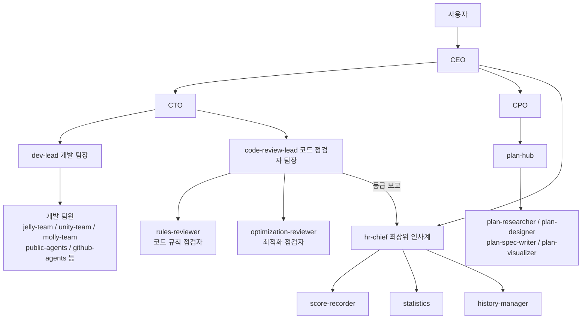

# Claude Code 하네스 체계 전체 조사 문서

- 작성일: 2026-08-03
- 작성 주체: dev-lead (Explore 2기 조사 + documenter 작성, CTO 지시)
- 조사 기준: 실물 파일 시스템 (`C:\DevelopRule\`, `C:\Users\zkdlm\.claude\`, 프로젝트 `CLAUDE.md`)
- 원칙: 실존 확인된 파일·경로만 기재. 추측 배제. 실물과 목록 간 불일치는 9장 부록에 별도 기록.

---

## 1. 개요 및 규칙 계층 구조

### 1.1 로딩 계층

```
C:\Users\zkdlm\.claude\CLAUDE.md          (사용자 전역 — "아무것도 작성하지 않는다" 주석 + @참조 1줄)
  └─ @C:\DevelopRule\CLAUDE.md            (전역 규칙 인덱스 — 하네스 체계의 단일 진입점)
       ├─ C:\DevelopRule\Rule\            (규칙 본문: Always / Unity Character / unity-csharp-rules)
       ├─ C:\DevelopRule\agents\          (에이전트 정의 — ~/.claude/agents 가 이 폴더로의 Junction)
       ├─ C:\DevelopRule\Skills\          (에이전트별 스킬 절차서)
       └─ 프로젝트 CLAUDE.md               (예: d:\ProjectFiles\JellyMolly_BaseTemp\CLAUDE.md — 프로젝트 전용 하네스 인덱스)
```

- 사용자 전역 `CLAUDE.md`는 내용을 갖지 않고 `@C:\DevelopRule\CLAUDE.md` 참조 1줄로 전역 규칙을 연결한다.
- 프로젝트 `CLAUDE.md`는 전역 규칙을 따르되, 프로젝트 전용 하네스(에이전트·스킬·산출물 위치·변경 이력)만 인덱싱한다.
- 실행 시 에이전트는 `~/.claude/agents/` 경로로 로드되지만, 해당 폴더는 `C:\DevelopRule\agents`로의 **Junction 링크**이므로 실물은 단일하다(3.1절).

### 1.2 Always 규칙 (`C:\DevelopRule\Rule\Always\Always.md`)

| 규칙 | 내용 |
|------|------|
| RULE 0 | 모든 작업은 CEO 에이전트 경유로 시작 |
| RULE 0-1 | 개발·기술 키워드는 CEO → CTO 위임 |
| 규칙 1 | 사용 에이전트·적용 규칙을 작업 완료 후 표기 |
| 규칙 2 | 에이전트 배치도를 먼저 제시하고 승인 후 진행 |
| 규칙 3 | 자동승인 |
| 규칙 4 | 에이전트 변경 추천 리스트 |
| 규칙 5 | 컨텍스트 사용량 관리 — Stop 훅 리마인더, 60% 이상 시 /compact 권장 |

### 1.3 규칙 세트

**Unity 캐릭터 아키텍처 규칙 — `C:\DevelopRule\Rule\Unity\Character\` (HUB.md + UCA 7건)**

| ID | 주제 |
|----|------|
| UCA-001 | ARCHITECTURE (MB/POCO 판단, 클래스 배치) |
| UCA-002 | MODEL |
| UCA-003 | VIEW (MonoBehaviour) |
| UCA-004 | FEATURE (기능 모듈, Strategy 판단) |
| UCA-005 | CONFIG (ScriptableObject) |
| UCA-006 | COMPOSITION (Entry, Installer/EventBus, Feature 간 통신) |
| UCA-007 | CONVENTION (네이밍·폴더·어셈블리, PR 체크리스트, 안티패턴) |

**Unity C# 규칙 — `C:\DevelopRule\Rule\unity-csharp-rules\` (HUB.md + UNITY-* 42건)**

| ID | 토픽 | ID | 토픽 | ID | 토픽 |
|----|------|----|------|----|------|
| 001 | ASYNC | 015 | CONST | 029 | ANNOTATION |
| 002 | API | 016 | SINGLETON | 030 | SOLID |
| 003 | NULL | 017 | EVENT | 031 | TASK |
| 004 | GENERIC | 018 | CAST | 032 | NETWORK |
| 005 | NAMING | 019 | COLLECTION | 033 | EDITOR |
| 006 | EXCEPT | 020 | DI | 034 | POOL |
| 007 | SERIAL | 021 | LIFECYCLE | 035 | MARKER |
| 008 | COMMENT | 022 | VALIDATE | 036 | CLASS |
| 009 | RESOURCE | 023 | PROFILE | 037 | PROPERTY |
| 010 | THREAD | 024 | TEST | 038 | ENUM |
| 011 | LINQ | 025 | CONFIG | 039 | INTERFACE |
| 012 | LOG | 026 | CONDITIONAL | 040 | VARIABLE |
| 013 | GAMEOBJ | 027 | REFLECT | 041 | FUNCTION |
| 014 | MEMORY | 028 | RECOVERY | 042 | STRUCT |

두 허브 모두 "작업 상황 → 규칙 ID" 매칭 표를 제공하며, 적용 후 보고서에 `적용 규칙: [ID...]` 명시를 요구한다.

### 1.4 `C:\DevelopRule\` 최상위 실물 구성

| 항목 | 상태 |
|------|------|
| CLAUDE.md, README.md | 존재 (CLAUDE.md 내부 구조도는 구버전 — 9장 참조) |
| Rule\, Skills\, agents\, plugins\, scores\, hr-data\history\ | 존재 |
| docs\ | 본 문서 작성 시(2026-08-03) 신규 생성 |
| ARCHITECTURE\, VISUALIZATIONS\ | 존재하나 빈 폴더 |
| rules\ (setup/always/details/forbidden) | 존재하지 않음 (CLAUDE.md 구조도에만 기재된 구버전 경로) |

---

## 2. 지휘 체계

### 2.1 RULE 0 — CEO 우선 소환

`~/.claude/settings.json`의 **UserPromptSubmit 훅**이 모든 사용자 프롬프트에 다음 컨텍스트를 주입한다.

> "[RULE 0] Before processing this request, you MUST spawn the CEO agent first using the Agent tool. Path: C:\DevelopRule\agents\management\ceo.md. Order: CEO -> CTO -> dev-lead. Exception: simple lookup questions only."

즉 단순 조회를 제외한 모든 요청은 CEO 에이전트를 먼저 스폰하는 것이 강제된다(훅 상세는 5장).

### 2.2 4개 지휘 라인

| 라인 | 경로 | 용도 |
|------|------|------|
| (a) 개발 | CEO → CTO → dev-lead(개발 팀장) → 개발 팀원 | 구현·설계·분석·리뷰 등 개발 전반 |
| (b) 기획 | CEO → CPO → plan-hub → plan-team 팀원 | 기획·컨셉·GDD·스펙·기획 시각화 |
| (c) 인사 | CEO → hr-chief(최상위 인사계) → score-recorder·statistics·history-manager | 점수 기록·통계·평가 이력 관리 |
| (d) 코드 점검 | CTO → code-review-lead(코드 점검자 팀장) → rules-reviewer·optimization-reviewer | 개발 완료 후 S~F 7등급 품질 평가, 결과는 CTO + hr-chief 양쪽 보고 |



### 2.3 코드 품질 등급 (agent-delegation·code-review-lead 공통)

| 등급 | 의미 |
|------|------|
| S | 완벽. 모든 기준 충족 + 모범 사례 |
| A | 우수. 기준 충족, 소수 개선점 |
| B | 양호. 대부분 충족, 일부 개선 필요 |
| C | 보통. 기본 충족, 다수 개선 필요 |
| D | 미흡. 기준 미달, 수정 필요 |
| E | 불량. 다수 규칙 위반 |
| F | 실패. 전면 재작업 필요 |

agent-delegation 스킬(`C:\DevelopRule\Skills\Management\agent-delegation.md`)은 위임 전 Always 규칙 확인 → 명령 분석(WHO/WHAT/WHEN) → 에이전트 선발 표 → 배치도 제시의 4단계 절차와 완료 보고 형식(작업/사용 에이전트/결과물 위치/적용 규칙)을 정의한다.

---

## 3. 에이전트 조직

### 3.1 저장 구조 — 단일 실물 + Junction

- 정의 원본: `C:\DevelopRule\agents\` (11개 팀 폴더)
- 실행 등록: `C:\Users\zkdlm\.claude\agents` — **`C:\DevelopRule\agents`로의 NTFS Junction**
- 따라서 통상적 "원본/등록본 이중 구조"가 아니라, 실물은 한 벌이며 두 경로가 같은 폴더를 가리킨다. DevelopRule 저장소에서 정의를 수정하면 즉시 전역 실행 경로에 반영된다.

### 3.2 팀별 에이전트 (11개 팀)

경로는 정의 원본 기준이며, `~/.claude/agents/...`로도 동일하게 접근된다.

**management (5) — `C:\DevelopRule\agents\management\`**

| 에이전트 | 역할 | 정의 파일 |
|----------|------|-----------|
| CEO | 사용자 명령 수신, CTO·CPO·인사계 위임, 최종 보고. 직접 실행하지 않음 | ceo.md |
| CTO | 기술 총괄. 시스템 설계 주도, 팀원 선발·dev-lead 배치, 완료 후 코드 점검 지시 | cto.md |
| CPO | 최고 기획 책임자. CEO 직속·CTO 동급. 기획 명령을 plan-team에 위임 | cpo.md |
| 개발 팀장 (dev-lead) | 개발 팀 인솔·관리. CTO에게 태스크·팀원을 받아 실지휘, 완료 보고 | dev-lead.md |
| 코드 점검자 팀장 (code-review-lead) | 점검자 배치, S~F 등급 수합, CTO + 인사계 보고 | code-review-lead.md |

**hr (4) — `C:\DevelopRule\agents\hr\`**

| 에이전트 | 역할 | 정의 파일 |
|----------|------|-----------|
| 최상위 인사계 (hr-chief) | CEO 직속. 코드 점검 결과 수합, 하위 인사계 총괄 | hr-chief.md |
| 점수 기록 담당 | 코드 점검 평가 점수를 파일로 기록·저장 | score-recorder.md |
| 통계 담당 | 에이전트별·기간별 평가 점수 분석, 통계 리포트 산출 | statistics.md |
| 이력 관리 담당 | 에이전트별 평가 이력 문서화, mistake-log.md 갱신 | history-manager.md |

**code-review (2) — `C:\DevelopRule\agents\code-review\`**

| 에이전트 | 역할 | 정의 파일 |
|----------|------|-----------|
| 코드 규칙 점검자 (rules-reviewer) | 코드 규칙·컨벤션 준수 평가, S~F 점수 산출 | rules-reviewer.md |
| 최적화 점검자 (optimization-reviewer) | 성능·최적화 영역 평가, S~F 점수 산출 | optimization-reviewer.md |

**jelly-team (12) — `C:\DevelopRule\agents\jelly-team\`**

| 에이전트 | 역할 | 정의 파일 |
|----------|------|-----------|
| jelly-hub | 젤리 캐릭터 총괄. 젤리 관련 작업 진입점, 담당자 분배·조율 | hub.md |
| jelly-architect | Entry/Feature/Bus/POCO 패턴 기반 구조 설계, MonoBehaviour→Feature 전환 설계 | architect.md |
| jelly-code-reviewer | 젤리 몰리 전용 5축 코드 점검. 직접 수정하지 않고 unity-documenter로 가이드 문서화 | code-reviewer.md |
| jelly-feature | 젤리 개별 능력(점프·흡수·분열·합체·변신 등) 구현 | feature.md |
| jelly-physics | SoftBody·Squash & Stretch·탄성·충돌·표면 마찰 등 젤리 물리 | physics.md |
| jelly-input | 조작 매핑, Input System 바인딩, 능력 발동 입력, 카메라 연동 | input.md |
| jelly-interaction | 환경·NPC·아이템·오브젝트 상호작용 규칙 | interaction.md |
| jelly-state | 체력·크기·색상·변이 상태 모델링, ScriptableObject 데이터, 상태 저장/복원 | state.md |
| jelly-system | 젤리 생성·소멸·라이프사이클·매니저·풀링 기반 시스템 | system.md |
| jelly-visual | 셰이더·머테리얼·파티클·메시 왜곡·표정 애니 | visual.md |
| jelly-optimizer | 젤리 특화 성능(SoftBody 변형·셰이더·MaterialPropertyBlock·풀링·다수 배치) 최적화 | optimizer.md |
| jelly-icon-artist | 에디터 스크립트로 절차적 PNG 아이콘 생성, sprite import 설정, USS/UGUI 연결 | icon-artist.md |

팀 부속 파일: `SKILL.md`(5축 점검 상세 가이드 — jelly-code-review-5axis), `mistake-log.md`(jelly-feature 실수 기록), `history\evaluation-history.md`(평가 이력).

**unity-team (15) — `C:\DevelopRule\agents\unity-team\`**

| 에이전트 | 역할 | 정의 파일 |
|----------|------|-----------|
| unity-hub | Unity 개발팀 총괄. 요청 분석 후 기획·개발·QA·최적화·지원 팀원에 분배 | hub.md |
| unity-architect | 시스템 구조·상태 머신·패턴·의존성·모듈 분리 설계 | architect.md |
| unity-developer | C# 스크립트 작성, 기능 구현, 버그 수정, 리팩토링 | developer.md |
| unity-code-reviewer | 코드 품질 검토, Unity 규칙 위반·버그·성능 이슈 탐지 | code-reviewer.md |
| unity-code-inspector | 4축 점검(null 제거·함수 분리·불필요 주석 삭제·루프 변수 캐싱) | code-inspector.md |
| unity-optimizer | 프로파일링, 드로우콜 최적화, Update 병목 제거, GC Alloc 감소 | optimizer.md |
| unity-qa | 기능 테스트, 엣지 케이스 검증, 버그 재현·리포트 | qa.md |
| unity-designer | Inspector 구성, 애니메이션 파라미터, UI 레이아웃, 씬 구성 설계 | designer.md |
| unity-lead-planner | 피처 범위·우선순위·마일스톤·작업 분배 총괄 기획 | lead-planner.md |
| unity-detail-planner | 구현 조건, 스펙 문서, 엣지 케이스, 동작 흐름 세부 기획 | detail-planner.md |
| unity-documenter | 기획·설계·리뷰·QA 산출물을 스펙/가이드/릴리스 노트로 통합 문서화 | documenter.md |
| unity-researcher | 기술 조사, 패키지·라이브러리 비교, Unity API 레퍼런스 수집 | researcher.md |
| unity-file-structure-manager | 스크립트·리소스·씬 배치 경로 결정, 구조 문서 최신화 | file-structure-manager.md |
| unity-sample-scene | 기능 검증용 씬·테스트 환경·프로토타입 씬 제작 | sample-scene.md |
| unity-region-formatter | 계층별 표준 #region 규칙 적용, 코드 구조 분리 | region-formatter.md |

팀 부속 파일: `mistake-log.md`, `history\evaluation-history.md`.

**molly-team (11) — `C:\DevelopRule\agents\molly-team\`**

| 에이전트 | 역할 | 정의 파일 |
|----------|------|-----------|
| molly-core-agent | MollyCore, 진화 7단계(Baby→Legend), EmotionState, EvoTracker, WobbleShader 연동 | molly-core-agent.md |
| molly-status-agent | StatusSystem 4스탯(Hunger/Happiness/Cleanliness/Fatigue), 오프라인 배치 계산, CareSystem | molly-status-agent.md |
| molly-economy-agent | EconomySystem 3종 재화, HeartSystem, RewardSystem, MonetizationSystem | molly-economy-agent.md |
| molly-interaction-agent | 4종 제스처(Tap/Drag-Pet/Hold/Shake) 감지, WobbleShader·파티클 연동 | molly-interaction-agent.md |
| molly-save-agent | SaveSystem JSON 직렬화, OfflineCareCalc, 클라우드 동기화, 로컬 알림 | molly-save-agent.md |
| molly-ui-agent | MainHomeUI·MiniGameUI·ShopUI, DOTween 트랜지션, HUD, 팝업 | molly-ui-agent.md |
| molly-visual-agent | WobbleShader 최적화, URP Sprite Atlas, 파티클, Spine 2D, Draw Call | molly-visual-agent.md |
| minigame-architect | IMiniGame 인터페이스, MiniGameManager 브릿지, 3종 미니게임 공통 구조 | minigame-architect.md |
| minigame-bubblepop | 버블팡 미니게임 구현 | minigame-bubblepop.md |
| minigame-jellyslide | 젤리 슬라이딩 퍼즐 구현 (6x6 그리드, Undo, BFS 힌트) | minigame-jellyslide.md |
| minigame-memorymatch | 기억력 카드 매칭 미니게임 구현 | minigame-memorymatch.md |

팀 부속 파일: `AGENTS.md`(11개 에이전트의 Wave별 개발 순서·의존성 정의), `PUBLIC_AGENTS.md`(몰리 프로젝트에서 함께 쓰는 관리·Unity 공용 에이전트 목록).

**plan-team (5) — `C:\DevelopRule\agents\plan-team\`**

| 에이전트 | 역할 | 정의 파일 |
|----------|------|-----------|
| plan-hub | plan-team 오케스트레이터. 기획 복합 작업 진입점, 팀원 분배·조율 | hub.md |
| plan-designer | 코어 루프·메카닉·GDD 초안·캐릭터/레벨 설계 원칙 | designer.md |
| plan-researcher | 레퍼런스 수집, 시장 조사, 경쟁작·트렌드 분석 | researcher.md |
| plan-spec-writer | GDD 기반 기능 스펙·시스템 스펙·요구사항 명세 | spec-writer.md |
| plan-visualizer | GDD·스펙·플로우를 Mermaid 기반 단일 HTML로 시각화 | visualizer.md |

**public-agents (8) — `C:\DevelopRule\agents\public-agents\`**

| 에이전트 | 역할 | 정의 파일 |
|----------|------|-----------|
| code-reviewer | 범용 코드 리뷰(품질·버그·패턴·성능·리팩토링) | code-reviewer.md |
| documenter | 마크다운 문서화, README, 회의록·작업 정리, 규칙 문서화 | documenter.md |
| researcher | 기술 조사, 라이브러리 비교, API 문서 분석, 레퍼런스 수집 | researcher.md |
| visualizer | Mermaid.js 기반 단일 HTML 시각화 제작 | visualizer.md |
| feedback-logger | 수행 실패·오류를 일일 피드백 문서에 기록, 주간 요약 생성 | feedback-logger.md |
| file-creator | 새 파일·폴더 구조·템플릿·보일러플레이트 생성 | file-creator.md |
| file-structure-manager | 파일 추가/이동/삭제 시 구조 문서 최신화 | file-structure-manager.md |
| git-push | 변경 분석, 컨벤션 준수 커밋 메시지 작성, push | git-push.md |

**public-team (1) — `C:\DevelopRule\agents\public-team\`**

| 에이전트 | 역할 | 정의 파일 |
|----------|------|-----------|
| animator-architect | Unity 애니메이터 구조화 공용 매니저. 컨트롤러 구조 정리 + 클립 인벤토리 + 엑셀 산출 3단계 파이프라인 지휘 | animator-architect.md |

**github-agents (8) — `C:\DevelopRule\agents\github-agents\`**

| 에이전트 | 역할 | 정의 파일 |
|----------|------|-----------|
| hub-github | GitHub 분석 팀 오케스트레이터. 팀 구성·작업 조율 | orchestrator\hub-github.md |
| repo-fetcher | gh CLI로 레포 정보·README·이슈/PR 통계·브랜치 구조 수집 | collector\repo-fetcher.md |
| repo-profiler | 기술 스택·프레임워크·빌드 시스템·디렉토리 구조 프로파일링 | analyzers\repo-profiler.md |
| code-analyzer | 안티패턴·복잡 함수·중복 코드·성능 이슈 분석 | analyzers\code-analyzer.md |
| dependency-analyzer | 의존성·버전·CVE 취약점 분석 | analyzers\dependency-analyzer.md |
| git-historian | 커밋 히스토리·활성도·기여자·마일스톤 분석 | analyzers\git-historian.md |
| github-reporter | 팀원 산출물 통합, 최종 분석 보고서 작성 | reporter\github-reporter.md |
| github-visualizer | Mermaid 기반 아키텍처·의존성·커밋 타임라인 다이어그램 | reporter\visualizer.md |

**rule-developer (4 + 오케스트레이터) — `C:\DevelopRule\agents\rule-developer\`**

GitHub 저장소를 분석해 규칙과 개발자 에이전트 명세를 생성하는 4단계 파이프라인.

| Phase | 에이전트 | 입력 → 출력 | 정의 파일 |
|-------|----------|-------------|-----------|
| 1 | Analyzer | GitHub URL → code-analysis-report.md | analyzer\AGENT.md (+SKILL.md) |
| 2 | Designer | code-analysis-report.md → rule-design-spec.md | designer\AGENT.md (+SKILL.md) |
| 3 | Spec Generator | rule-design-spec.md → developer-agent-spec.md | spec-generator\AGENT.md (+SKILL.md) |
| 4 | Validator | developer-agent-spec.md → validation-report.md + recommendations.md | validator\AGENT.md (+SKILL.md) |

- 파이프라인 정의: `ORCHESTRATOR.md` (2026-04-21 Phase 4 추가로 4단계 완성). 순차 실행이 원칙이며 특정 Phase 단독 재실행 가능.
- `AGENT.md`는 구버전으로 ORCHESTRATOR.md에 "폐기 예정"으로 명시되어 있다.

---

## 4. 스킬 체계

### 4.1 DevelopRule 스킬 — `C:\DevelopRule\Skills\` (5분류 + SKILL-INDEX.md)

`SKILL-INDEX.md`(마지막 업데이트 2026-05-01)가 스킬↔에이전트 매핑을 관리한다. 아래 "사용 에이전트"는 SKILL-INDEX 기재 기준이며, 미등재 스킬은 별도 표기했다.

**Dev (7)**

| 스킬 파일 | 사용 에이전트 | 역할 |
|-----------|--------------|------|
| Dev\jelly-5axis-review.md | jelly-code-reviewer | 젤리 몰리 전용 5축 점검 |
| Dev\unity-4axis-inspect.md | (SKILL-INDEX 미등재. 4축 점검 에이전트 unity-code-inspector 실존) | Unity 4축 점검 |
| Dev\unity-architecture-design.md | unity-architect, jelly-architect | 아키텍처 설계 원칙·절차 |
| Dev\unity-code-review.md | unity-code-reviewer, code-reviewer, rules-reviewer | 코드 리뷰 5축 체크리스트·절차 |
| Dev\unity-code-writing.md | 개발 에이전트 공용 보조 | 작업 유형별 규칙 ID 매칭 빠른 참조 |
| Dev\unity-optimization.md | unity-optimizer, jelly-optimizer, optimization-reviewer | 성능 최적화 절차·체크리스트 |
| Dev\unity-qa-testing.md | unity-qa | Given-When-Then 테스트·버그 리포트 |

**Design (3)**

| 스킬 파일 | 사용 에이전트 | 역할 |
|-----------|--------------|------|
| Design\jelly-architecture.md | jelly-architect | JellyMolly 전용 설계 (UCA-001, 004, 006) |
| Design\unity-inspector-design.md | unity-designer | Inspector·UI·Animator·Prefab 설계 |
| Design\unity-planning.md | unity-lead-planner, unity-detail-planner | 기획서 작성 형식·원칙 |

**ETC (6)**

| 스킬 파일 | 사용 에이전트 | 역할 |
|-----------|--------------|------|
| ETC\documentation.md | documenter, unity-documenter | 문서 작성 형식·저장 경로 기준 |
| ETC\research.md | researcher, unity-researcher | 조사 보고서 형식·출처 기준 |
| ETC\visualization.md | visualizer | HTML Mermaid 시각화 생성 절차 |
| ETC\feedback-logging.md | feedback-logger | 일일/주간 피드백 기록 절차 |
| ETC\file-management.md | file-creator, file-structure-manager, git-push | 파일 생성·구조 문서·Git 절차 |
| ETC\folder-structure-template.md | (SKILL-INDEX 미등재) | 폴더 구조 템플릿 |

**Management (3 + 목록 파일 1)**

| 스킬 파일 | 사용 에이전트 | 역할 |
|-----------|--------------|------|
| Management\agent-delegation.md | CEO, CTO, dev-lead, code-review-lead | 위임·배치도·완료 보고 절차 |
| Management\code-quality-grading.md | code-review-lead, rules-reviewer, optimization-reviewer | S~F 등급 산출 기준 |
| Management\system-design.md | CTO | 설계 선행 의사결정 프로세스 |
| Management\molly-orchestrator\SKILL_LIST.md | molly-team 11개 (목록 전용) | Wave 방식 병렬 구현 조율 — SKILL.md 본문은 미구현(list-only 명시) |

**Plan (5)**

| 스킬 파일 | 사용 에이전트 | 역할 |
|-----------|--------------|------|
| Plan\plan-orchestration.md | CPO (cpo.md 참조 스킬로 확인) | plan-team 위임·파이프라인·보고 흐름 |
| Plan\plan-design.md | (SKILL-INDEX 미등재) | 기획 설계 |
| Plan\plan-research.md | (SKILL-INDEX 미등재) | 기획 조사 |
| Plan\plan-spec-writing.md | (SKILL-INDEX 미등재) | 스펙 작성 |
| Plan\plan-visualization.md | (SKILL-INDEX 미등재) | 기획 시각화 |

### 4.2 전역 스킬 — `C:\Users\zkdlm\.claude\skills\` (6개)

| 스킬 | 용도 | 소속 파이프라인 |
|------|------|-----------------|
| harness | 하네스 구성 메타 스킬. 전문 에이전트 정의 + 사용 스킬 생성 + CLAUDE.md 하네스 포인터 등록. 하네스 구성·점검·감사·동기화 시 사용 | 단독 (plugins\harness 플러그인과 동일 계열) |
| review-and-document | code-reviewer → documenter → visualizer 3단계 자동 리뷰·문서화·시각화 파이프라인 | 리뷰 요청 시 필수 사용 |
| feedback-log | 수행 실패·오류·누락 시 일일 피드백 기록, 주간 요약 생성 | feedback-logger 계열 |
| animator-structure-extract | .controller YAML → 정규화 JSON (레이어·스테이트 머신·BlendTree·파라미터·트랜지션) | animator-architect Phase 1 |
| animation-clip-inventory | .fbx 내부 클립·.anim → 클립 인벤토리 JSON | animator-architect Phase 2 |
| animator-excel-export | 구조 JSON + 클립 JSON → 단일 .xlsx 머지 출력 (8개 시트) | animator-architect Phase 3 |

에이전트 폴더와 달리 `~/.claude/skills`는 Junction이 아닌 실제 폴더이며, DevelopRule\Skills와 별개 세트다.

---

## 5. 훅 설정 (`C:\Users\zkdlm\.claude\settings.json`)

| 이벤트 | 동작 | 연결 규칙 |
|--------|------|-----------|
| UserPromptSubmit | PowerShell로 additionalContext 주입: "[RULE 0] CEO 에이전트를 먼저 스폰할 것. Path: C:\DevelopRule\agents\management\ceo.md. Order: CEO -> CTO -> dev-lead. Exception: simple lookup questions only." | Always.md RULE 0 / RULE 0-1 |
| Stop | PowerShell로 systemMessage 출력: "컨텍스트 확인: /context — 60% 이상이면 /compact 실행 권장" | Always.md 규칙 5 (컨텍스트 사용량 관리) |

두 훅 모두 실제 등록 확인 완료. 그 외 훅 이벤트는 등록되어 있지 않다.

기타 settings.json 주요 설정: permissions.allow = Read, Glob, Grep, Bash(git:*), Bash, Write, Edit, MultiEdit / defaultMode "auto" / model "claude-fable-5[1m]" / effortLevel "xhigh" / enableWorkflows true / skipAutoPermissionPrompt true. `settings.local.json`은 존재하지 않으며, settings.json에 플러그인 관련 설정은 없다.

---

## 6. 프로젝트별 등록 하네스 — JellyMolly (`d:\ProjectFiles\JellyMolly_BaseTemp\CLAUDE.md`)

### 6.1 젤리 몰리 전용 코드 점검

| 항목 | 내용 |
|------|------|
| 에이전트 | `~/.claude/agents/jelly-team/code-reviewer.md` (jelly-code-reviewer) |
| 트리거 | 젤리 몰리 코드 점검/리뷰, MonoBehaviour 정리, 라이프사이클 리팩터링, static 정리, 자동 패씽 점검, null 검사 정리, 프로젝트 코드 전반 리뷰 |
| 점검 5축 | (1) 불필요 MonoBehaviour → POCO 전환 후보 식별, (2) Awake/Start/OnEnable/OnDisable 라이프사이클 본문 함수 분리, (3) 불필요 static 정리, (4) 의미 없는 자동 패씽(AddComponent/GetComponent/Find 폴백) 정리, (5) 방어적·불필요 null 검사 제거 |
| 문서화 위임 | unity-documenter (직접 수정하지 않고 수정 가이드 문서로 기록) |
| 산출물 | `docs/code-review/{YYYY-MM-DD}-jelly-molly-code-review.md` |
| 근거 스킬 | `Dev\jelly-5axis-review.md` + 팀 내 `jelly-team\SKILL.md`(점검 전 UNITY-021, 036, 041, 020, 022, 003, 006 필수 Read) |

### 6.2 애니메이터 구조화 공용 매니저

| 항목 | 내용 |
|------|------|
| 에이전트 | `~/.claude/agents/public-team/animator-architect.md` |
| 트리거 | 애니메이터 정리/구조화/명세, 애니메이션 목록 엑셀, 클립 정리, 시트 갱신, 스테이트 머신 정리 |
| 스킬 파이프라인 | 1단계 animator-structure-extract → 2단계 animation-clip-inventory → 3단계 animator-excel-export |
| 산출물 | 메인 `docs/animator/JellyMolly_Animator.xlsx`, 중간 JSON `docs/animator/_workspace/` |
| 의존성 | Python 3 + pyyaml, openpyxl (미설치 시 CSV 폴백) |

---

## 7. 플러그인 (`C:\DevelopRule\plugins\` — 4개)

| 플러그인 | 정체 |
|----------|------|
| Claude-Code-Usage-Monitor | Python(PyPI claude-monitor) 실시간 토큰 사용량 터미널 모니터링 도구. 소진율·비용 분석·세션 한도 예측 |
| harness | Claude Code 플러그인 v1.2.0 (revfactory/harness, Apache-2.0). "Agent Team & Skill Architect" — 에이전트 팀·스킬을 설계·생성하는 메타 스킬. 전역 `~/.claude/skills/harness`와 동일 계열 |
| slack | Slack 연동 경량 구성 (settings-template.json + SETUP_GUIDE.md + SKILL.md 3파일) |
| unity-cli | Go 기반 CLI. 커맨드라인에서 Unity Editor 제어 (AI 에이전트 사용 목적, 서버·설정 불요) |

참고: 4개 폴더는 소스 보관 형태이며, `~/.claude/plugins`에는 공식 마켓플레이스 캐시(claude-plugins-official)만 존재하고 위 4개는 플러그인 설치 목록·settings.json 어디에도 등록되어 있지 않다.

---

## 8. 변경 이력 관리 방식

### 8.1 프로젝트 CLAUDE.md 변경 이력 표

각 하네스는 프로젝트 `CLAUDE.md`에 **날짜 / 변경 내용 / 대상 / 사유** 4열 표로 이력을 누적한다. JellyMolly 실적:

| 날짜 | 변경 내용 |
|------|-----------|
| 2026-04-22 | 젤리 몰리 코드 점검 에이전트 초기 구성 (프로젝트 로컬) |
| 2026-04-22 | 에이전트 전역 이동(`~/.claude/agents/jelly-team/`) + 이름 정렬 |
| 2026-04-22 | 점검 축 3축 → 5축 확장 (축4 자동 패씽, 축5 방어적 null 검사 추가) |
| 2026-04-24 | 애니메이터 구조화 공용 매니저 초기 구성 (에이전트 1 + 스킬 3) |

### 8.2 평가·이력 데이터

| 저장소 | 내용 |
|--------|------|
| `C:\DevelopRule\scores\` | 코드 점검 평가 기록 7건 (2026-05-10 ~ 2026-05-23) + `statistics\` |
| `C:\DevelopRule\hr-data\history\` | 인사계 이력 데이터 |
| `agents\jelly-team\history\evaluation-history.md`, `agents\unity-team\history\evaluation-history.md` | 팀별 평가 이력 |
| `agents\jelly-team\mistake-log.md`, `agents\unity-team\mistake-log.md` | 반복 실수 기록 (예: jelly-feature — Animator 파라미터 문자열 리터럴, 라이프사이클 1줄 위임 위반, SerializeField 누락 폴백) |

운영 흐름: code-review-lead가 S~F 등급 수합 → hr-chief 보고 → score-recorder 기록(`scores\`) → statistics 통계 → history-manager가 evaluation-history·mistake-log 갱신.

---

## 9. 부록: 실물·목록 불일치

### 9.1 CTO 확인분

| # | 불일치 | 상세 |
|---|--------|------|
| 1 | `C:\DevelopRule\CLAUDE.md` 구조도 구버전 | `agents/general-agents/...` 구조와 `rules/` 디렉토리를 기재하고 있으나 실물에 없음 |
| 2 | `rules\` (setup/always/details/forbidden) 부재 | 실제 규칙은 `Rule\` (Always / Unity\Character / unity-csharp-rules) 구조 |
| 3 | cto.md 에이전트 풀 목록 불일치 | public-agents, jelly-team, unity-team, github-agents, rule-developer, plan-team 6개 팀만 기재. 실물 11개 팀 중 code-review, hr, management, molly-team, public-team 미기재 |
| 4 | 플러그인 목록 불일치 | CEO 목록에는 harness, Claude-Code-Usage-Monitor 2개만 언급. 실물은 slack, unity-cli 포함 4개 |
| 5 | ARCHITECTURE\, VISUALIZATIONS\ 빈 폴더 | 용도 미상 상태로 존재 |

### 9.2 조사 추가 발견분

| # | 불일치 | 상세 |
|---|--------|------|
| 6 | SKILL-INDEX.md → `Dev/unity-development/SKILL.md` 부재 | unity-developer 및 jelly 개발 에이전트 8개의 주 스킬로 지정돼 있으나 실물 없음 |
| 7 | SKILL-INDEX.md → `Design/unity-architecture/SKILL.md` 부재 | unity-architect 스킬로 지정돼 있으나 실물 없음 |
| 8 | SKILL-INDEX.md 경로 형식 불일치 | `Design/jelly-architecture/SKILL.md`, `Management/system-design/SKILL.md`로 폴더형 기재. 실물은 단일 파일 `Design\jelly-architecture.md`, `Management\system-design.md` |
| 9 | SKILL-INDEX.md 미등재 실물 스킬 | `Dev\unity-4axis-inspect.md`, `ETC\folder-structure-template.md`, `Plan\` 5종, `Management\molly-orchestrator\` |
| 10 | molly-orchestrator SKILL.md 미구현 | `SKILL_LIST.md` frontmatter에 status: list-only, "실제 SKILL.md 구현은 추후 작성" 명시 |
| 11 | rule-developer\AGENT.md 구버전 잔존 | ORCHESTRATOR.md 디렉토리 구조에 "구버전 - 폐기 예정" 명시 |
| 12 | molly-team Wave 배정 불일치 | `AGENTS.md`는 molly-save-agent를 Wave 0(선행 인프라)으로, `Skills\Management\molly-orchestrator\SKILL_LIST.md`는 Wave 1로 기재 |
| 13 | "이중 구조" 통념과 실물 상이 | `~/.claude/agents`는 별도 등록본이 아니라 `C:\DevelopRule\agents`로의 NTFS Junction. 실물은 단일 |
| 14 | plugins 미설치 상태 | `C:\DevelopRule\plugins` 4개는 소스 보관일 뿐, `~/.claude/plugins` 설치 목록·settings.json 어디에도 등록되지 않음 |
| 15 | agent-delegation 선발 표의 unity-development 계열 부재와 별개로, 표 기재 에이전트는 전원 실존 확인 | 선발 표 24행 전수 대조 결과 미실존 에이전트 없음 (참고 사항) |

---

문서 끝. 본 문서는 2026-08-03 실물 파일 기준 스냅샷이며, 하네스 변경 시 각 소관 인덱스(CLAUDE.md, SKILL-INDEX.md, 프로젝트 CLAUDE.md)와 함께 갱신을 권장한다.
